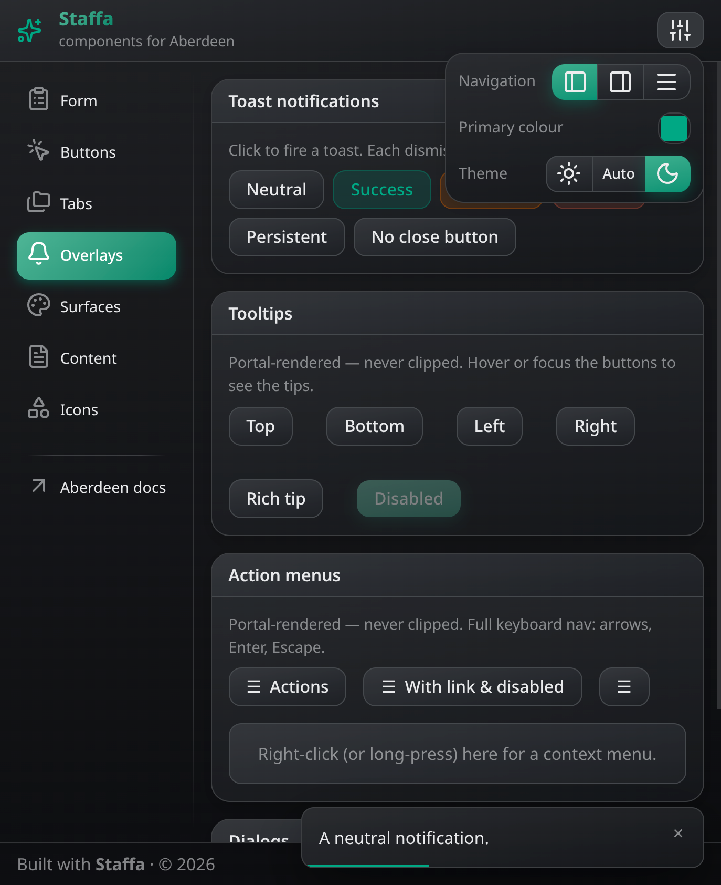

# Staffa

A small, opinionated TypeScript component library for the [Aberdeen](https://aberdeenjs.org) reactive UI library.

```ts
import A from "aberdeen";
import * as S from "staffa";

const $user = A.proxy({ name: "", email: "" });

S.main({
  title: "Sign up",
  maxWidth: "40rem",
  content: () => {
    S.form({
      submit: () => S.dialog({
        header: "Submitted",
        content: () => A.dump($user)
      }),
      content: () => {
        S.textline({ label: "Name", required: true, bind: A.ref($user, "name") });
        S.textline({ label: "Email", type: "email", bind: A.ref($user, "email") });
      },
      actions: () => S.button({ content: "Create account", type: "submit" }),
    });
  },
});
```

Staffa is made to look decent out of the box, but easily customizable at runtime.

## Screenshot



## Install

```sh
npm install staffa aberdeen
```

Aberdeen is a peer dependency. Staffa is published as ESM with TypeScript types.

## How it works

### Components are functions

Every component takes a single typed options object and draws DOM via Aberdeen. No classes, no web components. The `S` object collects all component functions:

```ts
S.button({ content: "Save", disabled: false });
S.box({ header: "Settings", content: () => { ... } });
```

### Options objects are typed and can be reactive

All components get their options in a typed object. The object may be an Aberdeen proxy, if you want to update the component in-place.

```ts
const $btn = A.proxy({ content: "Save", disabled: false });
S.button($btn);
setTimeout(() => // Later..
  $btn.disabled = true;  // button updates instantly
}, 3000);
```

### Rich text slots

Anywhere a component takes content, a `label`, `header`, button `text`, dialog body, etc, you can pass either a string or a `() => void` draw function. Strings render as **rich text**: `*italic*`, `**bold**`, `` `code` ``, `[link](/path)`. All text is safely escaped.

```ts
S.button({ content: "Save **now**" });
S.box({ header: "See the [docs](/docs)", content: () => { ... } });
```

### Surfaces

Staffa builds on **surfaces**: elements marked with `.s-s` that have their own background and derived text/border tokens. There are two families:

- **Neutral surfaces** — `.neutral` (and the implicit page at `:root`). A calm neutral whose shade steps automatically with nesting depth (each level a step away from the page colour, up to a cap). Use them for cards, bars, popovers — anything that just holds content. No variants.
- **Accent surfaces** — `.primary`, `.danger`, `.success`, `.warning`, `.link` (a bare `.s-s` defaults to primary). A bright fill with white ink, painted as a subtle single-colour gradient. They take a **variant**: `.filled` (default), `.tonal`, or `.outlined`. A surface nested *inside* an accent surface is always rendered filled, so it can't bleed into the vivid parent.

Components are built from these (`S.button` is a `.s-s.primary`, `S.box` a `.s-s.neutral`, etc.). Because component options include an optional `attrs` string, which has Aberdeen `A()` string semantics, you can easily override it:

```ts
S.button({ content: "Delete", attrs: ".danger" });
S.button({ content: "Cancel", attrs: ".neutral" });       // neutral button
S.box({ attrs: ".primary", content: () => { ... } });
```

Inside any surface (including `:root`), CSS variables are defined for the background and a set of safe foreground colors: `$s-bg`, `$s-text` (also applied as `color`), `$s-muted`, `$s-accent` (the surface's "pop" — the brand primary on neutral surfaces, the ink on accent surfaces), and `$s-faint`. By using these, components adapt to wherever they're nested.

The colour tokens are mode-independent and settable: `$s-primary` (the one brand colour — it tints the neutrals and defines `.s-s.primary`), `$s-danger`, `$s-success`, `$s-warning`, and `$s-link` (the link colour, which is also the fill of the `.s-s.link` surface). Links render in `$s-link` on neutral surfaces and in the ink on accent surfaces.

**Borders & shadows.** Neutral surfaces carry a subtle hairline border on their own (so a card looks like a card without any component help). Any surface can be lifted with `.shadow` or `.extra-shadow`: on a neutral surface that's a neutral drop shadow, on an accent surface it's a self-coloured glow (a lit button is just a `.primary` surface with `.shadow`), and on `.tonal`/`.outlined` it's ignored. `.no-shadow` removes a component's built-in shadow:

```ts
S.box({ attrs: ".extra-shadow", content: () => { ... } });   // a more raised card
S.button({ content: "Quiet", attrs: ".no-shadow" });          // drop the button glow
```

### Dark and light modes

Dark/light mode is detected from OS preference by default. If you want to override this (based on user preferences), use:

```ts
S.setDarkMode(true);       // force dark
S.setDarkMode(false);      // force light
S.setDarkMode(undefined);  // follow OS
```

*Hint:* A `buttonChooser` is probably the right component for a color scheme selector.

### Panel-stack navigation

Give `S.main()` a `routes` table instead of a `content` slot, and it takes over navigation for you. Each route draws one screen of your app — Staffa calls those **panels** — and the shell shows as many of them at a time as comfortably fit, each in its own **column**.

On a phone that means one panel at a time: a link opens a new panel on top of it, and closing that one brings the previous back, the way most mobile apps work. On a wider screen, panels that would have covered each other sit side by side instead. Pick a project from a list and it opens *beside* the list; pick another and it takes the first one's place. Your code doesn't know the difference.

```ts
const shell = S.main({
  title: "Trackle",
  nav: { items: [{ label: "Projects", href: "/projects" }] },
  routes: {
    "/projects": drawProjectList,
    "/projects/[projectId]": drawProject,
    "/projects/[projectId]/tasks/[taskId=integer]": drawProjectTask,
  },
  notFound: ($panel) => S.box({ header: "Not found", content: $panel.path }),
});

function drawProject($panel: S.Panel<{ projectId: string }>) {
  const { projectId } = $panel.params;    // typed from the route key
  $panel.title = `Project ${projectId}`;  // the shell puts it wherever it fits
  A(`a href=/projects/${projectId}/tasks/1 #Open the first task`);
}

// Etc..
```

Each handler gets a `$panel` object holding the params from its route, along with the things Staffa needs to know about the panel: what it's called, what it can do, how much room it wants, whether it's still loading. It's an Aberdeen proxy, so you can set those later (when your data arrives, say) and the shell keeps up.

**Route keys.** A segment wrapped in brackets is a param:

- `[name]` matches one segment, as a string.
- `[name=integer]` matches one segment, as a number.
- `[...name]` matches the rest of the path, as a string. It has to be the last thing in the key, and it needs at least one segment to match.

The first key that matches wins, and a segment a param refuses simply doesn't match, so it falls through to a later route, or to `notFound`. TypeScript reads each key and types that handler's `$panel.params` from it, so `params.taskId` above really is a `number`.

`integer` only accepts spellings that survive a round trip back to the same URL: `42` and `-7` and `0`, but not `007`, `1.5`, `0x10`, `-0` or anything past `Number.MAX_SAFE_INTEGER`. Otherwise `/tasks/42` and `/tasks/0042` would be two different paths for one record, and could sit open in two columns at once. For ids that aren't safe integers, such as snowflakes, use a plain `[id]` and keep them as strings.

`[...name]` hands you the remaining path exactly as it appears in the URL, still percent-encoded. Decoding it for you would be lossy: an encoded slash inside a segment would come back looking just like a separator. When you want the pieces, `name.split("/").map(decodeURIComponent)` gives them to you. (Single-segment params have no such ambiguity, so those *are* decoded.)

**Navigating is just links.** Write ordinary `<a href="/...">` links; Staffa handles the clicks (so don't also call Aberdeen's `interceptLinks()`).

The open panels form a **stack**, and one of them is the **current** panel: the one the URL names, and the rightmost column on screen. Usually that's the newest panel — but going back along the stack moves the cursor without closing anything (see the breadcrumbs below), so panels can sit *after* the current one too, parked just past the viewport's right edge.

- A link inside a panel opens its target on top of that panel, closing everything after it first. That's why clicking a second project replaces the open project instead of adding a third column — and why the panels you'd browsed past don't pile up.
- A `data-panel` attribute on the link picks a different one of the three navigations. `push` is the default just described; `replace` puts the target in place of the link's own panel rather than on top of it, which is what prev/next buttons want; and `open` leaves that panel behind altogether and gives the target its own stack, exactly as a nav item would — for a link that points somewhere else in the app, a search hit or a mention, where the panel you clicked from isn't the context you want to keep.
- A link to something that's already open goes back to it instead of opening it twice — a move along the stack, closing nothing. The same path is never in the stack twice.
- A link that isn't inside a panel (a nav item, or one in a dialog) has no panel to build on, so it replaces the stack as a whole: the panel you asked for, with its ancestor panels opened beneath it (see [below](#ancestors)). Panels that the new stack also contains stay as they are, so clicking the nav item for the section you're already in won't reset it. Clicking a nav item and opening that same URL in a fresh tab therefore give you the same columns.

**The stack is an object, not a global.** In routed mode `S.main()` hands back the panel stack, and every panel gets the same object as `$panel.stack` — which is what a route handler uses, since it runs while the `S.main()` call is still going and can't see its return value yet.

```ts
shell.pushPanel(path);                 // on top of the current panel
shell.replacePanel(path);              // in its place
shell.openPanelStack(path, beneath?);  // a whole arrangement, the way a nav item does
shell.closePanel(path?);               // the current panel, or a named one

shell.panels;              // the open panels, oldest first — the Panel objects themselves
shell.currentPanelIndex;   // which of them the URL is on
shell.currentPanel;        // shorthand for panels[currentPanelIndex]
```

Navigations settle asynchronously (closes travel through the browser's history), so each of the four methods returns a `Promise<boolean>`: `true` once it lands, `false` when it doesn't — an unsaved panel refused to close, a route guard said no, or another navigation superseded it. Ignore it unless you care.

`panels` is a live view rather than a copy, so writing through it works — `shell.panels[0].pinned = true` is the only way to pin a panel from outside its own handler. All three are reactive on the stack's shape: read one in a scope and it re-runs when panels open, close or the cursor moves. Don't hold a `Panel` across a navigation; read it fresh.

Navigating faster than the shell can settle is fine: closing travels through the browser's history, so it takes a moment to land, and anything asked for in the meantime waits for it rather than being dropped. Two quick Escapes (or back gestures) peel two panels, each aimed at the stack the one before it was heading for.

**Every panel must work at 360–540px**, because that is what it gets whenever two columns fit. `$panel.maxWidth` says how much *more* it can usefully take. The content area is the page, at most 1280px wide, minus the nav sidebar:

| `maxWidth` | How wide the panel gets | Good for |
| --- | --- | --- |
| `"half"` | Half the content area: 360 to 540px. | lists, detail forms — anything that reads well at phone width |
| `"full"` (default) | The whole content area: up to ~1100px. | ordinary screens; the safe default |
| `"screen"` | The whole window, no upper limit: ~1750px on a 1920px screen. | boards, wide tables, dense dashboards |

Below the width two columns need, everything takes the whole content area whatever it asked for. Those numbers assume a nav sidebar of around 170px; without one, add that back. Nothing fits beside a `"full"` on a standard 1280px page, but on a wide enough window a `"half"` still can, and the page grows past 1280px to hold both.

A column's width depends only on the size of the window, never on what else is open. So opening or closing a panel never resizes the ones already on screen, and never reflows what someone was reading. A lone `"half"` leaves its other half empty, and that is exactly where the next one lands. When more columns fit than the standard 1280px page holds (three halves, say), the page itself grows, staying centred, to hold them.

Columns tile that area, separated by a hairline and no gutter — a column brings its own padding, so their contents stay comfortably apart regardless.

The panel is sized before your handler runs, and `$panel.width` is the resolved figure in pixels — so a chart, a virtualised list or a column count has the real width from the first frame, with nothing to measure. Set `maxWidth` at the top of your handler and you draw at the new width; set it later and the panel reflows without being redrawn, so nothing in it is rebuilt or loses its state.

<a id="chrome"></a>

**A panel declares its chrome; the shell places it.** A screen says what it is called and what it can do; everything else in its column — headings, cards, boxes — is the screen's own content, drawn like any other. Where the chrome ends up depends on how many columns are showing and how wide the shell is, so the shell decides:

```ts
function drawTask($panel: S.Panel<{ taskId: number }>) {
  $panel.title = "Task 42";
  $panel.actions = () => S.button({ content: "Save", attrs: ".small", click: save });
  S.box({ header: "Task 42", content: drawTaskForm });   // ordinary content
}
```

On a wide screen the title becomes the stack's last crumb and the Save button sits in a quiet strip at the top of the column. On a phone the crumb is still there and Save moves into the top bar, where the app menu was. Nothing in your code measures the viewport, and no screen is written twice.

**The breadcrumbs are the navigation.** The top bar's second line writes the open panels out as breadcrumbs — `Projects / Trackle / Task 42` — with the panels currently on screen in bold. Clicking an earlier crumb goes back to it *without closing anything*: the panels right of it stay open, parked just past the viewport's right edge, and clicking their crumbs brings them back. Browsing the stack is free — it's opening a *new* panel that closes the panels after the one it came from. The app's name and logo link to the app's home (the `home` option, `/` by default; `null` links neither), going back to it when it's already open and opening it when it isn't. A stack too long for the bar scrolls sideways, in an `S.scrollStrip` like the tab strip's.

That line is the `subtitle`'s while the stack has nothing to add: one panel open, reachable from a nav item that is already highlighted in a visible sidebar. Otherwise the stack takes it, since it is then the only thing naming the screen.

Right-click (or long-press) a crumb for **Close** — which takes just that panel out, wherever it sits in the stack — and **Pin**. A pinned panel — its crumb wears a pin — never closes as a side effect of navigation elsewhere: where opening a new panel would prune it, it rides along beneath the new panel instead, one crumb click away. Pin the reference you keep coming back to, then navigate freely. An *explicit* close (Escape, `close()`, the crumb menu, `data-panel=replace`) still closes it, and it's yours from code as `$panel.pinned`. Because a crumb is a real link whose right-click the menu takes over, the menu also offers **Open in new tab** and **Copy link**.

A crumb can also wear a **●**: the panel holds unsaved work, and nothing will close it (see `$panel.unsaved` below).

| `$panel` | what it does |
| --- | --- |
| `title` | Names the screen: its breadcrumb, and `document.title` while it's the current panel. A panel that sets none borrows the first line of text in its own body — good enough for a crumb, but say it yourself. |
| `actions` | The screen's buttons or menu. In the column's chrome while several columns fit; in the top bar (taking the app `menu`'s place) once the shell is narrow. A link among them builds on this panel at both widths. |

Two deliberate rules there. `actions` are the screen's *verbs* — Save, Delete, Share, a menu — not a second way out: going back is the crumbs' job, at every width, and there is no back button even on a phone. And **`title` names the screen; it does not draw a heading** — a screen that wants its name in its own body writes it there, where it owns the typography.

A column's body keeps a comfortable `$3` of padding; a screen that wants edge-to-edge rows just writes `A("p:0")`, since the draw function's current element *is* the body.

**The rest of `$panel`:**

- `params` and `path`: read-only.
- `maxWidth`: as above, and live — set it whenever you like and the panel reflows.
- `loading`: set it while you're fetching. A new panel waits a moment before sliding in, so it can arrive with real content instead of empty, and shows a loading indicator if the wait drags on.
- `width` and `visible`: read-only and reactive. `width` is this column's width in pixels, for the rare content that genuinely differs by width. `visible` says whether this panel is on screen — not crowded out, not parked, not closing — which is the right question for per-panel floating UI like a FAB, since "am I the current panel?" answers wrongly when two columns are up.
- `pinned`: the crumb menu's Pin, from code.
- `unsaved`: set it while the panel holds work that must not be lost — a dirty form, an upload in flight. An unsaved panel **cannot be closed, by anything**: navigation and the back button park it instead (wearing a ● in its crumb), `close()` and the crumb menu's Close refuse, Escape steps left, and closing the browser tab runs into the browser's own are-you-sure. The tab title carries a leading `•` while *any* open panel is unsaved. Only the app clears the flag, which is its explicit "this is now discardable":

```ts
A(() => { $panel.unsaved = $form.dirty || undefined; });   // the whole dirty check

S.button({ content: "Discard", attrs: ".neutral", click: () => {
  $panel.unsaved = false;   // explicitly: the reactive scope above reruns too late
  void $panel.close();
}});
```

So a panel that can *be* unsaved needs its own way out — a Save or Discard among its `actions`. There is no "discard changes?" dialog anywhere: leaving is never blocked, the work just waits, parked, one crumb away.

- `close()`: closes this panel, wherever it sits in the stack (refused while it's `unsaved`). Behind a Cancel button, or a Save that closes:

```ts
S.button({ content: "Cancel", attrs: ".neutral", click: () => $panel.close() });
$panel.stack.closePanel();              // the current panel
$panel.stack.closePanel("/projects/7"); // that panel, wherever it is
```

Closing the current panel hands the focus to the panel on its left. Closing one that *isn't* current takes just that one away: the columns around it stay where they are and keep their state, and the URL doesn't change, because the current panel didn't move. Either way it becomes a history entry, so the browser's back button brings the panel back.

A closed panel is torn down at once: its `A.clean()` hooks run the moment it closes, so subscriptions, timers and requests stop there and then. Only its element hangs around, inert and frozen, for the length of the exit animation.

Escape steps one panel back along the stack: at the stack's end that closes the current panel, mid-stack it just moves left and parks the panel you leave, and at the stack's start it jumps to the navigation. The browser's back button replays whole arrangements — it re-opens what a navigation closed and re-parks what a crumb click brought back.

<a id="ancestors"></a>

**The back button, and links from elsewhere.** The URL holds the current panel; the rest of the stack — the panels before it, any parked after it, and which are pinned — is stored beside it in the browser's history entry. So back and forward step through whole arrangements of columns, and a reload brings the same columns back.

A URL that arrives without any of that (a shared link, a bookmark, a new tab) has nothing to restore, so Staffa builds the stack from the path: it walks the parent paths and opens each one you have a route for. With the routes above, `/projects/7/tasks/42` opens as three columns: the project list, project 7, and task 42. A parent path you have no route for is skipped, so if you don't want one screen appearing under another, just don't give it a route.

That only works for URLs that spell their own context out. A flat one — `/thread/[id]`, where a push notification lands — has no parent path to walk, so it would open as a lone column with nothing beneath it and nothing for Escape to do. `ancestors` is where you say what belongs under it. It's keyed by the same path templates as `routes`, so each entry gets that key's params, matched and typed:

```ts
S.main({
  routes: {
    "/mailbox/[id]": drawMailbox,
    "/thread/[id=integer]": drawThread,
  },
  ancestors: {
    "/thread/[id=integer]": ({ id }) => [`/mailbox/${mailboxOf(id)}`],   // id is a number
  },
});
```

Return the paths shallowest first, or nothing to leave that path to the parent-path walk — which is also what a route you don't list gets, so you only name the ones whose URL doesn't say where they belong. It's asked for every navigation that has no panel to build on, so a nav item and a fresh tab still agree.

It has to answer without drawing anything, which is why it lives here rather than on `$panel`: it's consulted while the navigation is still being worked out, before any route handler has run.

From code, `openPanelStack(path, beneath?)` opens the same kind of arrangement, either asking `ancestors` for the panels beneath or taking the ones you hand it.

Search params and the `#hash` belong to the current panel only. Anything another panel in the stack needs in order to redraw itself has to live in its path. (A panel you browse away from does get its search and hash back when a crumb makes it current again.)

**A few more things.**

- `columns: "single"` shows only the current panel, however wide the screen — the phone experience at every size. Only the display changes: the URL, the back button, unsaved panels and the panels' own close buttons all behave the same.
- `linkNavigation` sets what a link *without* a `data-panel` attribute does: `"push"` (the default), `"replace"`, or `"open"`. With `"open"` every click replaces the content as a whole — which, with flat routes, is the conventional sidebar-and-content app: one pane, swapped on every click, the crumb line simply naming it.
- Both are live: pass a proxied options object (or make the field a getter) and a change is adopted in place, every open panel keeping its state.
- Only one routed `S.main()` can be mounted at a time; a second one throws — the URL is global, so two of them would fight over it. Nothing else is global: the stack belongs to its shell, and each handler gets its own `$panel`, since several panels are alive at once.
- Navigating with `aberdeen/route`'s own `go()` works — an unsaved panel survives it too — but, like a link from outside a panel, it builds the whole stack from the path. So prefer the stack's own methods. A navigation guard your app registered with `route.setGuard` (an auth redirect, say) keeps working untouched: Staffa registers none of its own.
- Deep links need your static server to serve the app for unknown paths (the usual SPA fallback). For `http-server` that's `-P`, as in the demo command below.

### CSS reset

Staffa includes a lightweight CSS reset that makes bare semantic HTML look a bit better but unsurprising without additional styling. 

### Theming

The first step in theming is just setting some CSS variables. Everything derives from a single brand colour, `s-primary` (the neutral surface shades are tinted toward it too), so often that's all you need. This can be done through CSS directly, or using Aberdeen:

```ts
A.cssVars["s-primary"] = "#fdda58";
A.cssVars["s-danger"] = "#ee4422";
A.cssVars["s-radius"] = "4px";
```

See `src/theme.ts` for what other CSS variables are being used.

If you need further customization, just add some CSS to override the default styling. For instance, to add your own accent surface, set its background (and, if needed, its ink) — the subtle gradient and the rest of the tokens follow automatically:

```ts
A.insertGlobalCss({".s-s.my-surface": "--s-bg:#ef6b00 --s-text:#fff"});

S.button({
  content: "You'll want to click me",
  attrs: ".my-surface",
  click: () => S.alert("Good work!", {attrs: ".my-surface"})
});
```

Custom surface class names may be anything (other than the built-in modifiers `.tonal`, `.outlined`, `.small`, `.large`). The `.tonal` and `.outlined` variants work on your surface for free.

Note that when changing CSS like this, things *may* break if you upgrade Staffa. The recommended update strategy is therefore: don't!

If you want to make changes that are dependent upon the current light/dark mode setting, rely on Aberdeen reactivity:

```ts
A(() => {
  if (S.getDarkMode()) {
    A.cssVars["s-primary"] = "#aa9944";
    A.insertGlobalCss({".s-s.my-surface": "--s-bg:#444444 --s-text:#fff"});
  } else {
    A.cssVars["s-primary"] = "#fdda58";
    A.insertGlobalCss({".s-s.my-surface": "--s-bg:#cccccc --s-text:#000"});
  }
});
```

## Components

Components share naming conventions for options: `attrs` (outermost element), `contentAttrs` (children-holding element), `inputAttrs` (form control element), and `<region>Attrs` (sub-regions like `headerAttrs`/`footerAttrs`). Form components consistently support `label`, `help`, `error`, `disabled`, `required`, `name` through the `drawField()` helper.

### Layout & containers

- **`S.main(opts)`**: app shell, a sticky header with `logo`, `title`, `subtitle`, `menu` — plus, in routed mode, the breadcrumbs of the open panels; scrollable content area; footer. Set `maxWidth` to center the content. Give it a `nav` for a sidebar that collapses to a hamburger below 640 px — where the nav becomes a full page sliding in from the left, handing over to the chosen screen with a matching slide in from the right. Its `items` may be a reactive array; adding or removing one redraws just the sidebar, never the content beside it. An item with `items` of its own becomes a collapsible submenu: only the branch holding the current page stays unfolded, and clicking a branch selects its first leaf (expanding a branch doesn't dismiss the phone's full-page nav — only picking a leaf does). A page the menu holds nowhere leaves every fold as it was. An item can also `match` pages beyond its own `href` — a path prefix, or a `(path) => boolean` — claiming the detail screens that have no row of their own: it is then highlighted, and the branches above it stay unfolded, cold deep links included. A sidebar taller than the window scrolls, and follows the highlighted item: navigating to a page whose item sits past the fold scrolls it back into view. A navigation dismisses the collapsed nav by itself, links in your own custom rows included; `S.closeNav()` does it for the rows that *don't* navigate. Instead of a single `content` slot it can take a `routes` table — see [Panel-stack navigation](#panel-stack-navigation).
- **`S.box(opts | content)`**: surface with optional `header`/`footer` and padded body. Pass a function for shorthand `{ content }`. `close: fn` adds a ✕ that runs your dismissal — in the header row, or floating over the body when there is no header. (It is plain furniture: a routed screen gets its own way out from the shell, see [Panel-declared chrome](#chrome).)
- **`S.tabs(opts)`**: tablist with live tab panels and keyboard navigation. More tabs than fit make the strip scroll (see `S.scrollStrip`); selecting a tab any other way (the arrow keys, a `bind` written from elsewhere) scrolls it into view.
- **`S.scrollStrip(opts)`**: a horizontal row that scrolls once its content outgrows it, with a ‹ / › button appearing over whichever end still has something to reach — so it isn't just a swipe target. Its own scrollbar is hidden. `S.tabs` and the routed shell's breadcrumbs are built on it; reach for it for any row of chrome that can outgrow its space. `S.revealInStrip(el)` scrolls one of its children into view.
- **`S.form(opts | content)`**: form aligning fields in a column or responsive grid, with an `actions` bar. Prevents the default page reload.

### Form fields

- **`S.textline(opts)`**: single-line input (`text`, `password`, `email`, `number`, `tel`, `url`, `search`, dates, ...).
- **`S.textarea(opts)`**: multi-line input.
- **`S.checkbox(opts)`**: labelled checkbox.
- **`S.select(opts)`**: single-select dropdown backed by native `<select>` (styled control, OS dropdown).
- **`S.autocomplete(opts)`**: type-ahead combobox with `multi` (chips), `allowCustom` (free text), `required`, and dynamic `options`.

### Dialogs

- **`S.dialog(opts)`**: modal dialog with backdrop and fade transition. The `content` slot receives a `close()` function. Lifecycle is tied to the calling scope (disappears when cleaned up). Nesting stacks correctly.
- **`S.alert(msg)` / `S.confirm(msg)` / `S.prompt(msg, initial?)`**: promise-returning shortcuts.

### Actions

- **`S.button(opts | text)`**: button surface; restyle via `attrs` (e.g. `.danger`, `.outlined`), plus `size`, `disabled`, `icon`, `href` (renders `<a role=button>`). Defaults to filled `.primary`.
- **`S.iconButton(opts)`**: a bare glyph in a square hit area — no fill, no border, ink that lifts on hover. For chrome that mustn't compete with what it sits beside: the app shell's ✕ and ☰ are made of it, and it's usually what a page's `actions` want.
- **`S.buttonGroup(opts)`**: groups buttons, `attached` (segmented) or `spaced`.
- **`S.buttonChooser(opts)`**: single-select segmented control bound to a value.


### Icons

Staffa ships the full [Lucide icon set](https://lucide.dev/icons/) as named exports. Import only the ones you use, so a bundler tree-shakes the rest (the whole set is ~82 kB gzipped):

Each icon is a draw function usable anywhere a slot is accepted (e.g. a button `icon`), or called directly. Customize per call, or globally via `setDefaults()`:

```ts
import * as S from "staffa";
import { sparkles, bell } from "staffa/icons";
S.button({ content: "Save", icon: bell });
sparkles({ size: "1.5em", color: "var(--s-primary)", strokeWidth: 1.5 });
```

Options: `size`, `color` (defaults to `currentColor`), `strokeWidth`, `cap`, `join`, `attrs`.

### Other

- **`S.menuButton(opts)` / `S.addContextMenu(opts)` / `S.showFloatingMenu(opts)`**: dropdown menus from a button, right-click/long-press context menus, and the underlying floating menu primitive — with keyboard navigation. A menu closes itself when the page navigates.
- **`S.menu(opts)`**: the same menu rows drawn in place — for a nav or settings column of your own. Items with nested `items` form a collapsible tree; `onLeafSelect` fires only when a leaf is picked, never for a branch unfolding.
- **`S.closeNav()`**: dismisses `S.main`'s navigation when it's showing as an overlay (the full page on a phone, the dropdown on a wider screen). For custom nav rows that act without navigating.
- **`S.toast(opts)`**: transient notification at the bottom of the viewport.
- **`S.addTooltip(el, opts)`**: tooltip on hover, attached to an existing element.

Two-way binding uses Aberdeen proxies: pass `bind: A.ref($obj, "key")` to form fields.

## Browser (no bundler)

`staffa/all.js` is a pre-built ESM bundle. Use an [import map](https://developer.mozilla.org/en-US/docs/Web/HTML/Reference/Elements/script/type/importmap):

```html
<script type="importmap">
{
  "imports": {
    "aberdeen": "https://cdn.jsdelivr.net/npm/aberdeen/dist/src/aberdeen.js",
    "aberdeen/route": "https://cdn.jsdelivr.net/npm/aberdeen/dist/src/route.js",
    "aberdeen/transitions": "https://cdn.jsdelivr.net/npm/aberdeen/dist/src/transitions.js",
    "staffa/all.js": "https://cdn.jsdelivr.net/npm/staffa/dist/staffa.esm.js"
  }
}
</script>
<script type="module">
  import A from "aberdeen";
  import * as S from "staffa/all.js";
  // ...
</script>
```

It includes all components, but not the icons.

## Extending Staffa

Staffa is designed for extension. A component is simply a plain function taking a typed options object and drawing Aberdeen DOM. This section explains the philosophy so extensions follow the same patterns.

### Design principles

1. **Components are functions**. They take one typed options object, emit Aberdeen DOM, and *usually* return nothing.

2. **Reuse option types.** Define options by extending `ContentOptions` (for layout components) or `FieldOptions` (for form controls) from `src/core.ts` and `src/components/field.ts`. Don't reinvent fields like `attrs`, `label`, `help`, etc.

3. **Reach for reactivity deliberately.** Pass option strings straight to `A` as positional args (the caller's scope). Only wrap a dedicated `A(() => ...)` scope where it matters: input elements (recreation loses focus), or large subtrees you don't want to redraw. Use `A.peek(() => ...)` when you need a value but must not subscribe.

4. **Build on surfaces.** Mark elements `.s-s` and add `.neutral` or an accent role (`.primary`, `.danger`, …) plus an optional variant. Inside them, use the contextual CSS variables (`$s-text`, `$s-bg`, `$s-muted`, `$s-accent`, `$s-faint`, ...) so components adapt to wherever they're nested. Hard-coding colors in components shouldn't be needed, but if you must, make sure you set *both* foreground and background.

5. **No outer margins.** Components don't margin themselves; spacing is the parent's job. Content components set default `padding` on the content element; `contentAttrs` overrides it.

6. **Make everything styleable.** Provide `attrs`, `contentAttrs`, `inputAttrs`, and `<region>Attrs` hooks so callers can customize. Apply `attrs` last so it can override component classes.

7. **Use semantic HTML and ARIA.** Prefer native elements (`<button>`, `<label>`, `<form>`, `<section>`) and native behaviour. Add ARIA only where semantics fall short (e.g. tabs, combobox).

8. **Use CSS.** Use `A.insertGlobalCss({...})` at module top level to provide (nested) CSS styling for your component. Give your top-level element the `s-<component-name>` class. Avoid inventing further classes; lean on nesting (`&` for the element, bare key for descendants) and element/structural selectors.  

9. **Reuse form controls.** Use `drawField()` and call `applyControlAttrs()`.

10. **Function over form.** Provide enough contrast. Stick to UI conventions to help users; buttons have a rounded border, links are underlined, text input background is white, etc.

### Adding a component to Staffa

The previous section is good advice for any project-specific custom, but should definitely be followed for any new components to be included in Staffa. In addition, you'd want to: 

1. Create `src/components/<name>.ts`.
2. Define `<Name>Options` extending `ContentOptions`, `FieldOptions`, or a plain interface. Add TSDoc on every option.
3. Add a TSDoc `@example` on the function.
4. Register in `src/index.ts` (the `S` object + type re-export).
5. Add it to the demo, cover it in the visual tests (`tests/*.spec.ts`), and run `npm run build` and `npm run typecheck`.

See `src/components/button.ts` and `src/components/dialog.ts` for examples.

## Commands

```sh
npm run build      # compile TypeScript to dist/
npm run typecheck  # check types
npx http-server -P "http://localhost:8080/demo/index.html?"   # demo at http://localhost:8080/demo
                   # (-P is the SPA fallback the demo's routed URLs need)
npx shotest test   # visual tests: click through the demo, screenshotting every step
npx shotest review # review/accept the visual changes against the baseline
```

The visual tests (`tests/*.spec.ts`) need a build first (`npm run build`); they serve the repo root themselves and click through every demo page. Accepted baselines live in `test-accepted/`.

## AI skill

If you use Claude Code, GitHub Copilot or another AI agents that supports Skills, Staffa includes a `skill/` directory that provides specialized knowledge to the AI about how to use the library effectively.

To use this, it is recommended to symlink the skill into your project's `.claude/skills` directory:

```sh
mkdir -p .claude/skills
ln -s ../../node_modules/staffa/skill .claude/skills/staffa
```

## Changelog

What changed in each release, and what to do about the breaking ones, is in [CHANGELOG.md](CHANGELOG.md).

*Hint:* the recommended update strategy for a library this young is: don't. Pin it, and read the changelog before you move.
